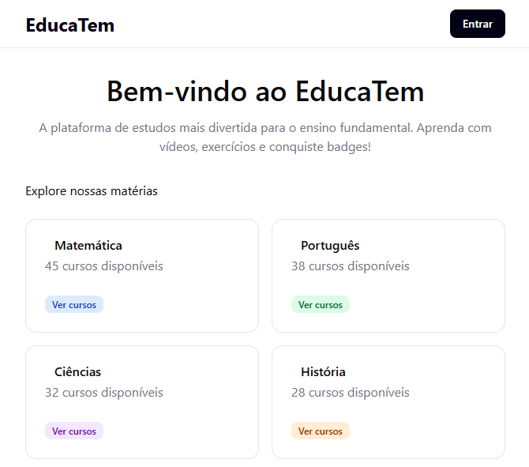
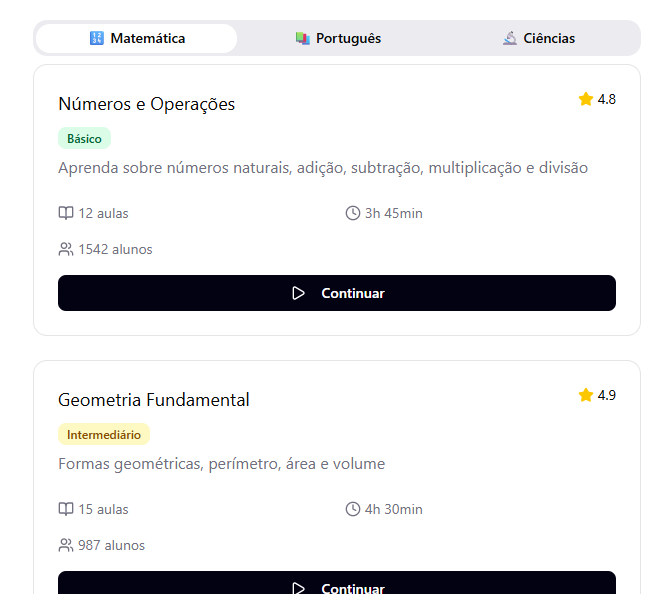
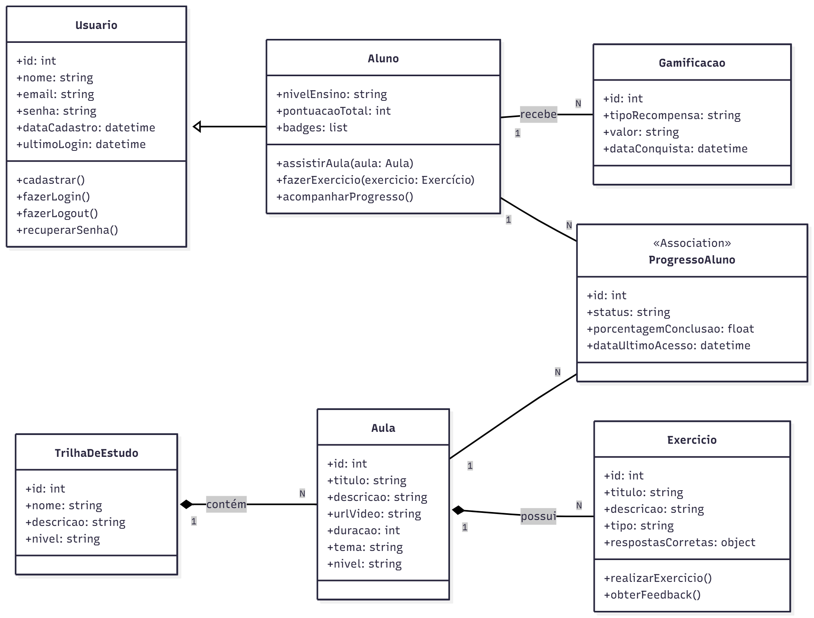
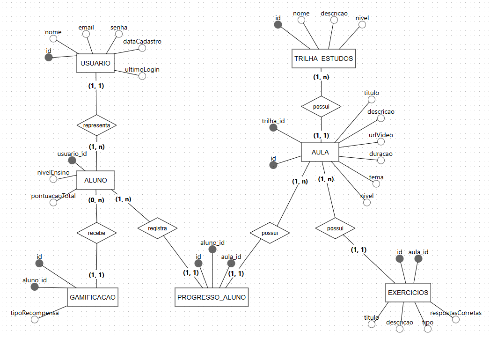

# 4. Projeto da Solução

<span style="color:red">Pré-requisitos: <a href="03-Modelagem do Processo de Negocio.md"> Modelagem do Processo de Negocio</a></span>

---

**ARQUITETURA DO SOFTWARE**

## 4.1. Arquitetura da Solução

A arquitetura da solução será dividida em duas camadas principais, com uma integração de banco de dados:

- **Frontend e Backend (Next.js):** Desenvolvido com **Next.js**, o projeto unificará as camadas de frontend (interface do usuário e interatividade) e backend (lógica de negócio e APIs) através de suas funcionalidades de roteamento de API (Next.js API Routes). O frontend será responsável pela renderização da interface e consumo das APIs internas, enquanto o backend processará as requisições, gerenciará a lógica de negócio e interagirá com o banco de dados.
- **Banco de Dados:** Utilizará **NeonDB**, um banco de dados compatível com **PostgreSQL**, para armazenar todas as informações do sistema, como dados de usuários, cursos, progresso e gamificação.

A comunicação entre o frontend e as Next.js API Routes ocorrerá de forma integrada na própria aplicação Next.js, e as API Routes se comunicarão com o NeonDB utilizando drivers PostgreSQL.

**Diagrama:**


---

**MODELAGEM VISUAL DAS TELAS**

## 4.2. Wireframe / Mockup

Wireframe e Mockup são representações visuais das telas de um sistema **antes** do desenvolvimento do código.  
Eles ajudam a planejar, comunicar ideias e validar a interface com antecedência.

### Finalidade

- **Planejamento da interface** → organizar elementos (botões, menus, campos, imagens) e definir a estrutura de navegação.
- **Comunicação da ideia** → facilitar o diálogo entre desenvolvedores, designers, clientes e usuários.
- **Validação antecipada** → coletar feedback antes de investir tempo e recursos na programação.
- **Guia para desenvolvimento** → servir como referência visual durante a implementação.

💡 **_Diferença:_**

- **Wireframe** → simples, sem cores ou imagens detalhadas; foca na estrutura e posicionamento.
- **Mockup** → mais próximo do visual final, com cores, fontes e imagens, mas sem interatividade completa.

**Exemplo de wireframe:**


📌 **Entrega:** incluir imagens ou links para os wireframes/mockups.

**Wireframe 1 — Tela Principal**  


**Wireframe 2 — Tela de Login**  


**Wireframe 3 — Tela do Curso**  


**Wireframe 4 — Tela - Trilhas de Estudo**  


---

**UML**

## 4.3 Diagrama de Classes

O diagrama de classes ilustra graficamente como será a estrutura do software, e como cada uma das classes da sua estrutura estarão interligadas. Essas classes servem de modelo para materializar os objetos que executarão na memória.



### Descrição das Classes e seus Relacionamentos:

A seguir, são detalhadas as principais classes do sistema, seus atributos, métodos e os relacionamentos entre elas, fundamentais para a estrutura da plataforma "EducaTem".

  **1. Classe Usuário**

  - **Propósito:** Representa qualquer pessoa com acesso à plataforma, seja aluno, professor ou responsável. Serve como uma classe base para perfis específicos.
  - **Atributos:**
    - `id`: Identificador único do usuário (chave primária).
    - `nome`: Nome completo do usuário.
    - `email`: Endereço de e-mail do usuário (único).
    - `senha`: Senha do usuário (criptografada).
    - `dataCadastro`: Data e hora do cadastro do usuário.
    - `ultimoLogin`: Data e hora do último acesso do usuário.
  - **Métodos:**
    - `cadastrar()`: Permite a criação de uma nova conta de usuário.
    - `fazerLogin()`: Autentica o usuário na plataforma.
    - `fazerLogout()`: Finaliza a sessão do usuário.
    - `recuperarSenha()`: Inicia o processo de recuperação de senha.

  **2. Classe Aluno**

  - **Propósito:** Representa um estudante da plataforma, herdando características de `Usuário` e adicionando informações específicas de aprendizado.
  - **Herda de:** `Usuário`
  - **Atributos:**
    - `nivelEnsino`: Nível de ensino do aluno (ex: fundamental, médio).
    - `pontuacaoTotal`: Pontuação acumulada nas atividades gamificadas.
    - `badges`: Lista de distintivos (badges) conquistados pelo aluno.
  - **Métodos:**
    - `assistirAula(aula: Aula)`: Registra a visualização de uma aula.
    - `fazerExercicio(exercicio: Exercício)`: Permite a realização de exercícios.
    - `acompanharProgresso()`: Exibe o progresso do aluno nas trilhas de estudo.
  - **Relacionamentos:**
    - `1:N` com `ProgressoAluno` (um aluno tem muitos progressos).
    - `1:N` com `Gamificacao` (um aluno pode ter muitas recompensas).

  **3. Classe TrilhaDeEstudo**

  - **Propósito:** Organiza o conteúdo didático em temas e níveis específicos, guiando o aprendizado do aluno.
  - **Atributos:**
    - `id`: Identificador único da trilha de estudo (chave primária).
    - `nome`: Nome da trilha (ex: Matemática Fundamental).
    - `descricao`: Descrição detalhada da trilha.
    - `nivel`: Nível de ensino associado à trilha.
  - **Relacionamentos:**
    - `1:N` com `Aula` (uma trilha contém muitas aulas).

  **4. Classe Aula**

  - **Propósito:** Representa uma vídeo aula individual dentro de uma trilha de estudo.
  - **Atributos:**
    - `id`: Identificador único da aula (chave primária).
    - `titulo`: Título da aula.
    - `descricao`: Descrição do conteúdo da aula.
    - `urlVideo`: URL para o vídeo da aula.
    - `duracao`: Duração da aula em minutos.
    - `tema`: Tema da aula.
    - `nivel`: Nível de ensino da aula.
  - **Relacionamentos:**
    - `N:1` com `TrilhaDeEstudo` (muitas aulas pertencem a uma trilha).
    - `1:N` com `Exercício` (uma aula pode ter vários exercícios).
    - `1:N` com `ProgressoAluno` (uma aula pode ser registrada em vários progressos de alunos).

  **5. Classe Exercício**

  - **Propósito:** Oferece atividades práticas para reforçar o aprendizado das aulas.
  - **Atributos:**
    - `id`: Identificador único do exercício (chave primária).
    - `titulo`: Título do exercício.
    - `descricao`: Enunciado ou descrição do exercício.
    - `tipo`: Tipo de exercício (ex: múltipla escolha, verdadeiro/falso).
    - `respostasCorretas`: Objeto ou array com as respostas corretas.
  - **Métodos:**
    - `realizarExercicio()`: Permite que o aluno interaja com o exercício.
    - `obterFeedback()`: Fornece feedback imediato sobre a resposta do aluno.
  - **Relacionamentos:**
    - `N:1` com `Aula` (muitos exercícios estão associados a uma aula).

  **6. Classe ProgressoAluno**

  - **Propósito:** Registra o status e o avanço de um aluno em relação a uma aula específica.
  - **Atributos:**
    - `id`: Identificador único do registro de progresso (chave primária).
    - `alunoId`: Chave estrangeira para o `Aluno`.
    - `aulaId`: Chave estrangeira para a `Aula`.
    - `status`: Status da aula para o aluno (ex: 'iniciada', 'concluída').
    - `porcentagemConclusao`: Porcentagem de conclusão da aula pelo aluno.
    - `dataUltimoAcesso`: Data do último acesso do aluno a essa aula.
  - **Relacionamentos:**
    - `N:1` com `Aluno` (muitos progressos para um aluno).
    - `N:1` com `Aula` (muitos progressos para uma aula).

  **7. Classe Gamificacao**

  - **Propósito:** Gerencia os pontos, badges e outras recompensas para motivar os alunos.
  - **Atributos:**
    - `id`: Identificador único do registro de gamificação (chave primária).
    - `alunoId`: Chave estrangeira para o `Aluno`.
    - `tipoRecompensa`: Tipo de recompensa (ex: 'ponto', 'badge').
    - `valor`: Valor da recompensa (ex: 10 pontos, nome do badge).
    - `dataConquista`: Data da conquista da recompensa.
  - **Relacionamentos:**
    - `N:1` com `Aluno` (muitas recompensas para um aluno).

  As referências abaixo irão auxiliá-lo na geração do artefato “Diagrama de Classes”.

  > - [Diagramas de Classes - Documentação da IBM](https://www.ibm.com/docs/pt-br/rational-soft-arch/9.6.1?topic=diagrams-class)
  > - [O que é um diagrama de classe UML? | Lucidchart](https://www.lucidchart.com/pages/pt/o-que-e-diagrama-de-classe-uml)

---

**BANCO DE DADOS**

## 4.4. Modelo de Dados

A solução proposta exige um banco de dados capaz de armazenar e relacionar as informações necessárias para os processos mapeados, garantindo integridade e controle de acesso por perfil de usuário.

O desenvolvimento deve seguir **três etapas**:

---

### 4.4.1 Diagrama Entidade-Relacionamento (DER)

O **Diagrama Entidade-Relacionamento (DER)** descreve as entidades, atributos e relacionamentos do sistema.  
Utilize a ferramenta **[BR Modelo Web](https://www.brmodeloweb.com/lang/pt-br/index.html)** para criar o diagrama.



#### Descrição das Entidades e Relacionamentos:

A modelagem do banco de dados relacional para a plataforma "Trilha Do Saber" é composta pelas seguintes entidades e seus respectivos atributos e relacionamentos:

**1. Entidade `USUARIO`**

- **Propósito:** Armazenar informações básicas de todos os usuários da plataforma.
- **Atributos:**
  - `id_usuario` (PK - Chave Primária)
  - `nome`
  - `email` (UNIQUE - Não permite e-mails duplicados)
  - `senha`
  - `data_cadastro`
  - `ultimo_login`

**2. Entidade `ALUNO`**

- **Propósito:** Armazenar informações específicas dos alunos, estendendo a entidade `USUARIO`.
- **Atributos:**
  - `id_aluno` (PK - Chave Primária, FK - Chave Estrangeira referenciando `USUARIO.id_usuario`)
  - `nivel_ensino` (Ex: 'fundamental', 'medio')
  - `pontuacao_total` (Pontuação acumulada do aluno)
- **Relacionamento:**
  - `USUARIO` 1:1 `ALUNO`: Um usuário pode ser, e apenas um, aluno.

**3. Entidade `TRILHA_ESTUDO`**

- **Propósito:** Organizar o conteúdo das aulas em trilhas temáticas e de níveis.
- **Atributos:**
  - `id_trilha` (PK - Chave Primária)
  - `nome_trilha`
  - `descricao_trilha`
  - `nivel_trilha` (Ex: 'fundamental', 'medio')

**4. Entidade `AULA`**

- **Propósito:** Armazenar os detalhes de cada vídeo aula disponível na plataforma.
- **Atributos:**
  - `id_aula` (PK - Chave Primária)
  - `id_trilha` (FK - Chave Estrangeira referenciando `TRILHA_ESTUDO.id_trilha`)
  - `titulo_aula`
  - `descricao_aula`
  - `url_video`
  - `duracao` (Em minutos)
  - `tema_aula`
  - `nivel_aula` (Ex: 'fundamental', 'medio')
- **Relacionamento:**
  - `TRILHA_ESTUDO` 1:N `AULA`: Uma trilha de estudo pode conter muitas aulas.

**5. Entidade `EXERCICIO`**

- **Propósito:** Armazenar as questões e detalhes dos exercícios associados às aulas.
- **Atributos:**
  - `id_exercicio` (PK - Chave Primária)
  - `id_aula` (FK - Chave Estrangeira referenciando `AULA.id_aula`)
  - `titulo_exercicio`
  - `descricao_exercicio`
  - `tipo_exercicio` (Ex: 'multipla_escolha', 'verdadeiro_falso')
  - `respostas_corretas` (Pode ser um JSON ou texto formatado com as respostas)
- **Relacionamento:**
  - `AULA` 1:N `EXERCICIO`: Uma aula pode ter muitos exercícios.

**6. Entidade `PROGRESSO_ALUNO`**

- **Propósito:** Rastrear o progresso de cada aluno em cada aula.
- **Atributos:**
  - `id_progresso` (PK - Chave Primária)
  - `id_aluno` (FK - Chave Estrangeira referenciando `ALUNO.id_aluno`)
  - `id_aula` (FK - Chave Estrangeira referenciando `AULA.id_aula`)
  - `status_aula` (Ex: 'iniciada', 'concluida')
  - `porcentagem_conclusao`
  - `data_ultimo_acesso`
- **Relacionamentos:**
  - `ALUNO` N:1 `PROGRESSO_ALUNO`: Um aluno pode ter muitos registros de progresso.
  - `AULA` N:1 `PROGRESSO_ALUNO`: Uma aula pode ter muitos registros de progresso.
  - A combinação (`id_aluno`, `id_aula`) pode ser uma chave composta para garantir um único progresso por aluno por aula.

**7. Entidade `GAMIFICACAO`**

- **Propósito:** Registrar as recompensas (pontos e badges) conquistadas pelos alunos.
- **Atributos:**
  - `id_gamificacao` (PK - Chave Primária)
  - `id_aluno` (FK - Chave Estrangeira referenciando `ALUNO.id_aluno`)
  - `tipo_recompensa` (Ex: 'ponto', 'badge')
  - `valor_recompensa` (Valor numérico para pontos ou nome do badge)
  - `data_conquista`
- **Relacionamento:**
  - `ALUNO` 1:N `GAMIFICACAO`: Um aluno pode ter muitas recompensas de gamificação.

**Orientações:**

- Todas as entidades devem possuir chave primária.
- Relacionamentos devem estar corretamente cardinalizados.
- O diagrama deve contemplar todas as funcionalidades levantadas nos processos de negócio.

**Exemplo de imagem:**


📌 **Entrega:** gere o diagrama no BR Modelo, exporte em **.png** e inclua-o nesta seção.

---

### 4.4.2 Esquema Relacional

O **Esquema Relacional** converte o Modelo ER para tabelas relacionais, incluindo chaves primárias, estrangeiras e restrições de integridade.

#### Descrição do Esquema Relacional (PostgreSQL/NeonDB):

O esquema relacional da plataforma "Trilha Do Saber" será implementado no **NeonDB (PostgreSQL)**, com as seguintes tabelas, colunas, tipos de dados e restrições:

**1. Tabela `Usuarios`**

- **Propósito:** Armazenar dados de autenticação e informações básicas de todos os usuários.
- **Colunas:**
  - `id_usuario` SERIAL PRIMARY KEY
  - `nome` VARCHAR(100) NOT NULL
  - `email` VARCHAR(100) NOT NULL UNIQUE
  - `senha` VARCHAR(255) NOT NULL
  - `data_cadastro` TIMESTAMPTZ NOT NULL DEFAULT CURRENT_TIMESTAMP
  - `ultimo_login` TIMESTAMPTZ
- **Restrições:**
  - UNIQUE (`email`)

**2. Tabela `Alunos`**

- **Propósito:** Complementar as informações dos usuários que são alunos.
- **Colunas:**
  - `id_aluno` INT NOT NULL PRIMARY KEY
  - `nivel_ensino` VARCHAR(50) NOT NULL
  - `pontuacao_total` INT DEFAULT 0
- **Restrições:**
  - FOREIGN KEY (`id_aluno`) REFERENCES `Usuarios`(`id_usuario`) ON DELETE CASCADE ON UPDATE CASCADE
  - CHECK (`nivel_ensino` IN ('fundamental', 'medio'))

**3. Tabela `TrilhasEstudo`**

- **Propósito:** Categorizar e organizar o conteúdo das aulas.
- **Colunas:**
  - `id_trilha` SERIAL PRIMARY KEY
  - `nome_trilha` VARCHAR(100) NOT NULL UNIQUE
  - `descricao_trilha` TEXT
  - `nivel_trilha` VARCHAR(50) NOT NULL
- **Restrições:**
  - CHECK (`nivel_trilha` IN ('fundamental', 'medio'))

**4. Tabela `Aulas`**

- **Propósito:** Armazenar os detalhes das vídeo aulas.
- **Colunas:**
  - `id_aula` SERIAL PRIMARY KEY
  - `id_trilha` INT NOT NULL
  - `titulo_aula` VARCHAR(255) NOT NULL
  - `descricao_aula` TEXT
  - `url_video` VARCHAR(255) NOT NULL
  - `duracao` INT NOT NULL
  - `tema_aula` VARCHAR(100)
  - `nivel_aula` VARCHAR(50) NOT NULL
- **Restrições:**
  - FOREIGN KEY (`id_trilha`) REFERENCES `TrilhasEstudo`(`id_trilha`) ON DELETE RESTRICT ON UPDATE CASCADE
  - CHECK (`nivel_aula` IN ('fundamental', 'medio'))

**5. Tabela `Exercicios`**

- **Propósito:** Armazenar as questões e opções dos exercícios.
- **Colunas:**
  - `id_exercicio` SERIAL PRIMARY KEY
  - `id_aula` INT NOT NULL
  - `titulo_exercicio` VARCHAR(255) NOT NULL
  - `descricao_exercicio` TEXT
  - `tipo_exercicio` VARCHAR(50) NOT NULL
  - `respostas_corretas` JSONB NOT NULL
- **Restrições:**
  - FOREIGN KEY (`id_aula`) REFERENCES `Aulas`(`id_aula`) ON DELETE CASCADE ON UPDATE CASCADE
  - CHECK (`tipo_exercicio` IN ('multipla_escolha', 'verdadeiro_falso', 'aberta'))

**6. Tabela `ProgressoAlunos`**

- **Propósito:** Rastrear o andamento de cada aluno em cada aula.
- **Colunas:**
  - `id_progresso` SERIAL PRIMARY KEY
  - `id_aluno` INT NOT NULL
  - `id_aula` INT NOT NULL
  - `status_aula` VARCHAR(50) NOT NULL
  - `porcentagem_conclusao` DECIMAL(5,2) DEFAULT 0.00
  - `data_ultimo_acesso` TIMESTAMPTZ NOT NULL DEFAULT CURRENT_TIMESTAMP
- **Restrições:**
  - FOREIGN KEY (`id_aluno`) REFERENCES `Alunos`(`id_aluno`) ON DELETE CASCADE ON UPDATE CASCADE
  - FOREIGN KEY (`id_aula`) REFERENCES `Aulas`(`id_aula`) ON DELETE CASCADE ON UPDATE CASCADE
  - UNIQUE (`id_aluno`, `id_aula`)
  - CHECK (`status_aula` IN ('iniciada', 'concluida', 'pendente'))

**7. Tabela `Gamificacao`**

- **Propósito:** Registrar as recompensas (pontos e badges) conquistadas pelos alunos.
- **Colunas:**
  - `id_gamificacao` SERIAL PRIMARY KEY
  - `id_aluno` INT NOT NULL
  - `tipo_recompensa` VARCHAR(50) NOT NULL
  - `valor_recompensa` VARCHAR(255) NOT NULL
  - `data_conquista` TIMESTAMPTZ NOT NULL DEFAULT CURRENT_TIMESTAMP
- **Restrições:**
  - FOREIGN KEY (`id_aluno`) REFERENCES `Alunos`(`id_aluno`) ON DELETE CASCADE ON UPDATE CASCADE

**Orientações:**

- Inclua todos os atributos das entidades.
- Defina tipos de dados adequados para cada campo.
- Configure as restrições de integridade (NOT NULL, UNIQUE, FOREIGN KEY, etc.).

📌 **Entrega:** exporte o diagrama do Workbench e adicione a imagem aqui.

**Exemplo de imagem:**


---

### 4.4.3 Modelo Físico

O **Modelo Físico** é o script SQL que cria as tabelas no banco de dados.

#### Script SQL para Criação do Banco de Dados (PostgreSQL/NeonDB):

```sql
CREATE TABLE Usuarios (
    id_usuario SERIAL PRIMARY KEY,
    nome VARCHAR(100) NOT NULL,
    email VARCHAR(100) NOT NULL UNIQUE,
    senha VARCHAR(255) NOT NULL,
    data_cadastro TIMESTAMPTZ NOT NULL DEFAULT CURRENT_TIMESTAMP,
    ultimo_login TIMESTAMPTZ
);

CREATE TABLE Alunos (
    id_aluno INT PRIMARY KEY,
    nivel_ensino VARCHAR(50) NOT NULL,
    pontuacao_total INT DEFAULT 0,
    CONSTRAINT fk_aluno_usuario FOREIGN KEY (id_aluno) REFERENCES Usuarios(id_usuario) ON DELETE CASCADE ON UPDATE CASCADE,
    CONSTRAINT chk_nivel_ensino CHECK (nivel_ensino IN ('fundamental', 'medio'))
);

CREATE TABLE TrilhasEstudo (
    id_trilha SERIAL PRIMARY KEY,
    nome_trilha VARCHAR(100) NOT NULL UNIQUE,
    descricao_trilha TEXT,
    nivel_trilha VARCHAR(50) NOT NULL,
    CONSTRAINT chk_nivel_trilha CHECK (nivel_trilha IN ('fundamental', 'medio'))
);

CREATE TABLE Aulas (
    id_aula SERIAL PRIMARY KEY,
    id_trilha INT NOT NULL,
    titulo_aula VARCHAR(255) NOT NULL,
    descricao_aula TEXT,
    url_video VARCHAR(255) NOT NULL,
    duracao INT NOT NULL,
    tema_aula VARCHAR(100),
    nivel_aula VARCHAR(50) NOT NULL,
    CONSTRAINT fk_aula_trilha FOREIGN KEY (id_trilha) REFERENCES TrilhasEstudo(id_trilha) ON DELETE RESTRICT ON UPDATE CASCADE,
    CONSTRAINT chk_nivel_aula CHECK (nivel_aula IN ('fundamental', 'medio'))
);

CREATE TABLE Exercicios (
    id_exercicio SERIAL PRIMARY KEY,
    id_aula INT NOT NULL,
    titulo_exercicio VARCHAR(255) NOT NULL,
    descricao_exercicio TEXT,
    tipo_exercicio VARCHAR(50) NOT NULL,
    respostas_corretas JSONB NOT NULL,
    CONSTRAINT fk_exercicio_aula FOREIGN KEY (id_aula) REFERENCES Aulas(id_aula) ON DELETE CASCADE ON UPDATE CASCADE,
    CONSTRAINT chk_tipo_exercicio CHECK (tipo_exercicio IN ('multipla_escolha', 'verdadeiro_falso', 'aberta'))
);

CREATE TABLE ProgressoAlunos (
    id_progresso SERIAL PRIMARY KEY,
    id_aluno INT NOT NULL,
    id_aula INT NOT NULL,
    status_aula VARCHAR(50) NOT NULL,
    porcentagem_conclusao DECIMAL(5,2) DEFAULT 0.00,
    data_ultimo_acesso TIMESTAMPTZ NOT NULL DEFAULT CURRENT_TIMESTAMP,
    CONSTRAINT fk_progresso_aluno FOREIGN KEY (id_aluno) REFERENCES Alunos(id_aluno) ON DELETE CASCADE ON UPDATE CASCADE,
    CONSTRAINT fk_progresso_aula FOREIGN KEY (id_aula) REFERENCES Aulas(id_aula) ON DELETE CASCADE ON UPDATE CASCADE,
    UNIQUE (id_aluno, id_aula),
    CONSTRAINT chk_status_aula CHECK (status_aula IN ('iniciada', 'concluida', 'pendente'))
);

CREATE TABLE Gamificacao (
    id_gamificacao SERIAL PRIMARY KEY,
    id_aluno INT NOT NULL,
    tipo_recompensa VARCHAR(50) NOT NULL,
    valor_recompensa VARCHAR(255) NOT NULL,
    data_conquista TIMESTAMPTZ NOT NULL DEFAULT CURRENT_TIMESTAMP,
    CONSTRAINT fk_gamificacao_aluno FOREIGN KEY (id_aluno) REFERENCES Alunos(id_aluno) ON DELETE CASCADE ON UPDATE CASCADE
);
```

## 📌ATENÇÃO: banco.sql salvo na pasta src/bd

---
